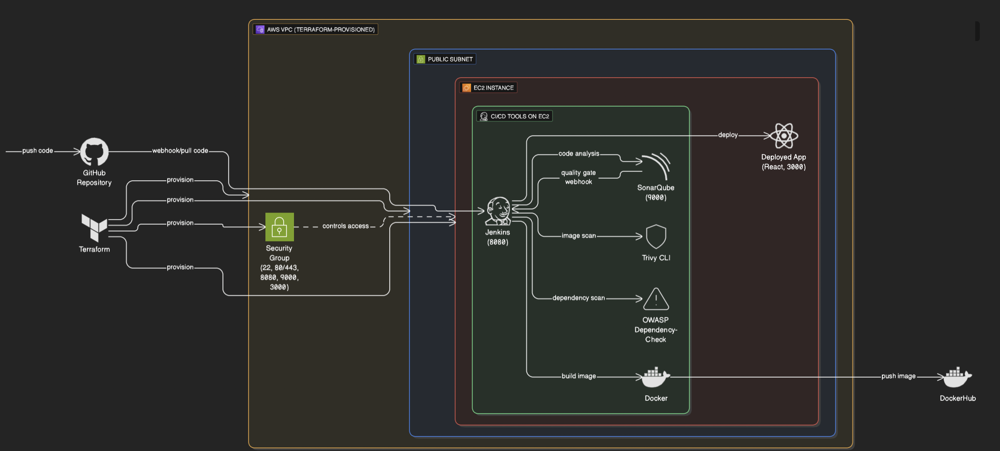

# Scalable CI/CD Pipeline & AWS DevSecOps Homelab

[](https://www.terraform.io/) [](https://www.jenkins.io/) [](https://www.docker.com/) [](https://www.sonarqube.org/) [](https://github.com/aquasecurity/trivy) [](https://github.com/open-policy-agent/gatekeeper)

☁️ **AWS DevSecOps Homelab**
Automated CI/CD pipeline with secure AWS landing zone, EKS with OPA/Gatekeeper policy enforcement, Terraform, Jenkins, Docker, SonarQube, Trivy, OWASP Dependency-Check, and Lambda auto-remediation for misconfigured resources. Includes a **full bootstrap script** with optional auto-cleanup.

---

## Table of Contents

1. [Topology](#topology)
2. [Architecture Overview](#architecture-overview)
3. [Prerequisites](#prerequisites)
4. [Repository Structure](#repository-structure)
5. [Getting Started](#getting-started)
6. [Bootstrap Script & Cleanup](#bootstrap-script--cleanup)
7. [Instance Configuration](#instance-configuration)
8. [Jenkins & Tool Configuration](#jenkins--tool-configuration)
9. [Pipeline Setup](#pipeline-setup)
10. [Application Folder (`/app`)](#application-folder-app)
11. [Best Practices](#best-practices)
12. [Next Steps & Enhancements](#next-steps--enhancements)
13. [Resources](#resources)

---

## Topology



Single public VPC hosting:

* EC2 for Jenkins, Docker, SonarQube, Trivy
* Managed EKS cluster with OPA/Gatekeeper
* Lambda functions for auto-remediation of misconfigured S3 buckets
* GuardDuty & AWS Config monitoring

---

## Architecture Overview

* **VPC & Subnets**: provisioned by Terraform
* **Security Groups**: SSH (22), HTTP/HTTPS (80/443), Jenkins (8080), SonarQube (9000), React app (3000)
* **EC2 Instance**: Amazon Linux 2 (`t3.large`) running:

  * Jenkins, Docker, SonarQube, Trivy
  * Lambda invoke CLI
* **EKS Cluster**: managed via Terraform + Helm for Gatekeeper
* **Policies** enforced via Gatekeeper:

  * No `:latest` container images
  * No privileged containers
  * Mandatory `app` and `owner` labels
* **AWS Config & Lambda**:

  * Auto-remediates public S3 buckets
  * Captures evidence logs

---

## Prerequisites

* AWS CLI (`aws configure`)
* Terraform ≥ 1.5.0
* Docker
* `kubectl` & `helm` (optional; EC2 bootstrap installs required tools)
* Jenkins admin credentials
* (Optionally) existing EC2 keypair

---

## Repository Structure

```text
.
├── app/                   # React frontend
├── kube/                  # Gatekeeper templates & constraints
├── lambda/                # S3 remediation Lambda
├── scripts/               # Bootstrap, simulate, and validation scripts
├── terraform/             # Terraform configs (bootstrap, main, eks)
├── Jenkinsfile            # CI/CD pipeline definition
├── Makefile               # Convenience commands
└── README.md              # This file
```

---

## Getting Started

### 1. Clone the repository

```bash
git clone https://github.com/your-repo/scalable-ci-cd-pipeline-for-aws-devsecops.git
cd scalable-ci-cd-pipeline-for-aws-devsecops
chmod +x scripts/*.sh
```

### 2. Configure Terraform variables

Create or edit `terraform.tfvars`:

```hcl
region        = "us-east-1"
instance_type = "t3.large"
my_ip         = "203.0.113.0/32"
```

### 3. Provision infrastructure

```bash
terraform -chdir=terraform/bootstrap-backend init
terraform -chdir=terraform/bootstrap-backend apply -auto-approve

terraform -chdir=terraform/main init
terraform -chdir=terraform/main apply -auto-approve

terraform -chdir=terraform/eks init
terraform -chdir=terraform/eks apply -auto-approve
```

Outputs include `deployer_key.pem`, EC2 public IP, Jenkins URL, SonarQube URL, React app URL, and EKS kubeconfig.

---

## Bootstrap Script & Cleanup

`./scripts/bootstrap.sh` automates:

* Backend creation (S3 + DynamoDB for remote Terraform state)
* Main infrastructure deployment
* EKS cluster creation & Gatekeeper constraints
* Jenkins, Docker, SonarQube, Trivy setup
* Lambda auto-remediation deployment
* Evidence collection (`evidence/`)
* Optional auto-cleanup

**Usage examples**:

```bash
# Default: auto-cleanup after 1 hour
./scripts/bootstrap.sh

# Keep infrastructure running
./scripts/bootstrap.sh --no-cleanup

# Custom auto-cleanup delay
./scripts/bootstrap.sh --cleanup-after 30
```

---

## Instance Configuration

SSH into EC2:

```bash
ssh -i terraform/deployer_key.pem ec2-user@${instance_public_ip}
```

Verify services:

```bash
sudo systemctl status jenkins
docker ps
trivy --version
```

---

## Jenkins & Tool Configuration

1. Browse `http://${instance_public_ip}:8080`
2. Install plugins:

   * Docker Pipeline, SonarQube Scanner, OWASP Dependency-Check
3. Configure global tools and credentials:

   * JDK, NodeJS, SonarQube Scanner, Dependency-Check, Docker
   * DockerHub and SonarQube token credentials

---

## Pipeline Setup

1. Create pipeline job (`amazon-frontend`)
2. Use root `Jenkinsfile`; update Git repo URL, DockerHub creds, and image name

---

## Application Folder (`/app`)

```bash
docker build -t amazon-frontend ./app
docker run -d -p 3000:3000 amazon-frontend
```

Visit `http://localhost:3000`.

---

## Best Practices

* Least-privilege IAM for all roles
* Restricted SSH ingress (CIDR-limited)
* Remote Terraform state (S3 + DynamoDB locking)
* Modular Terraform configuration
* Evidence capture for auditors (`evidence/`)
* Automated policy enforcement via Gatekeeper

---

## Next Steps & Enhancements

* Expand GuardDuty auto-remediation
* Additional Gatekeeper constraints & unit tests
* CloudWatch alerts and logging improvements
* Migrate to Argo CD / GitOps pipelines
* Jenkins configuration backup automation

---

## Resources

* AWS Docs: [https://aws.amazon.com/documentation/](https://aws.amazon.com/documentation/)
* Terraform: [https://www.terraform.io/docs](https://www.terraform.io/docs)
* Jenkins: [https://www.jenkins.io/doc/](https://www.jenkins.io/doc/)
* SonarQube: [https://docs.sonarqube.org/](https://docs.sonarqube.org/)
* Trivy: [https://github.com/aquasecurity/trivy](https://github.com/aquasecurity/trivy)
* OPA / Gatekeeper: [https://github.com/open-policy-agent/gatekeeper](https://github.com/open-policy-agent/gatekeeper)
