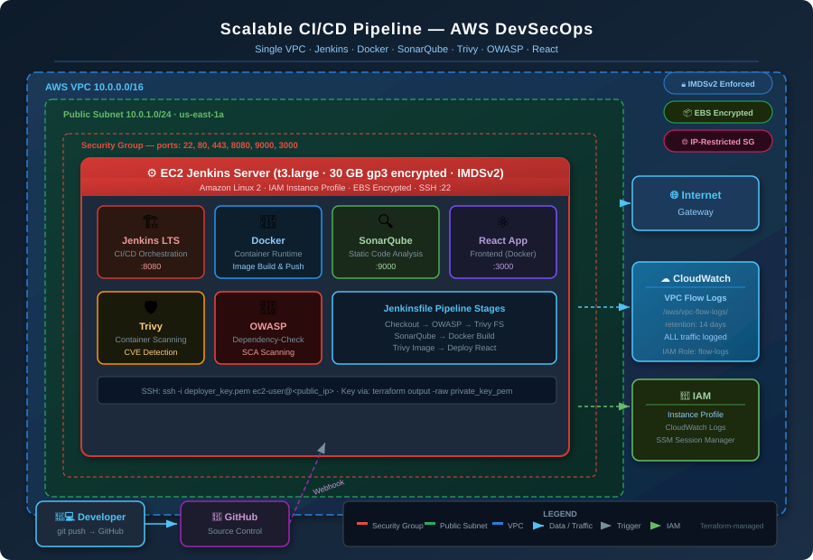

# Scalable CI/CD Pipeline for AWS DevSecOps

[](https://www.terraform.io/) [](https://aws.amazon.com/) [](https://www.jenkins.io/) [](https://www.docker.com/) [](https://www.sonarqube.org/) [](https://github.com/aquasecurity/trivy)

AWS DevSecOps CI/CD pipeline deploying a React frontend on EC2 with Terraform, Jenkins, Docker, SonarQube, Trivy, and OWASP Dependency-Check.

> **SSH private key**: After `terraform apply`, retrieve the key with:
> ```bash
> terraform output -raw private_key_pem > deployer_key.pem && chmod 400 deployer_key.pem
> ```
> The key is stored in Terraform state. Use an encrypted S3 backend with restricted IAM access to protect it in shared environments.

---

## Quickstart (For Experienced Users)

```bash
# 1. Clone repo and enter terraform folder
git clone https://github.com/r-ramos2/scalable-ci-cd-pipeline-for-aws-devsecops.git
cd scalable-ci-cd-pipeline-for-aws-devsecops/terraform

# 2. Configure your IP
cp terraform.tfvars.example terraform.tfvars
# edit terraform.tfvars → set allowed_cidr = "YOUR_PUBLIC_IP/32"

# 3. Deploy infrastructure
terraform init
terraform apply -auto-approve

# 4. Connect to EC2
ssh -i ./deployer_key.pem ec2-user@$(terraform output -raw instance_public_ip)

# 5. Access Jenkins: http://$(terraform output -raw instance_public_ip):8080
```

---

## Table of Contents

1. [Architecture](#architecture)
2. [Architecture Overview](#architecture-overview)
3. [Prerequisites](#prerequisites)
4. [Repository Structure](#repository-structure)
5. [Getting Started](#getting-started)
6. [Instance Configuration](#instance-configuration)
7. [Jenkins Configuration & Tools](#jenkins-configuration--tools)
8. [Pipeline Setup](#pipeline-setup)
9. [Application Folder (/app)](#application-folder-app)
10. [Cleanup](#cleanup)
11. [Best Practices](#best-practices)
12. [Security Considerations](#security-considerations)
13. [Next Steps & Enhancements](#next-steps--enhancements)
14. [Resources](#resources)

---

## Architecture


Single public VPC with one EC2 host running Jenkins, Docker, SonarQube, and Trivy; secured by a dedicated security group.

---

## Getting Started

### 1. Clone the repo

```bash
git clone https://github.com/r-ramos2/scalable-ci-cd-pipeline-for-aws-devsecops.git
cd scalable-ci-cd-pipeline-for-aws-devsecops/terraform
```

### 2. Configure variables & authentication

**Important:** Terraform generates an RSA keypair. After `terraform apply`, retrieve the private key manually:
```bash
terraform output -raw private_key_pem > deployer_key.pem && chmod 400 deployer_key.pem
```

Create your configuration file:

```bash
cp terraform.tfvars.example terraform.tfvars
```

Edit `terraform.tfvars` and set your public IP:

```hcl
# Required: Your current public IP (find with: curl ifconfig.me)
allowed_cidr = "203.0.113.25/32"  # REPLACE with YOUR_PUBLIC_IP/32
instance_type = "t3.large"
```

**Do not leave example RFC-5737 addresses in place when you deploy.**

### 3. Provision infrastructure

```bash
# Initialize Terraform and download providers
terraform init

# Validate configuration syntax
terraform validate

# Preview infrastructure changes
terraform plan -out=plan.tfplan

# Apply the plan (creates AWS resources)
terraform apply plan.tfplan
```

Outputs: 
* SSH private key location
* Public IPs for all instances

Save these outputs:

```bash
terraform output > lab_info.txt
```

---

## Instance Configuration

**Connect via SSH:**

```bash
ssh -i ./deployer_key.pem ec2-user@$(terraform output -raw instance_public_ip)
```

**Verification:**

```bash
sudo systemctl status jenkins
docker ps
trivy --version
```

Bootstrap logs: `/var/log/bootstrap.log`

The bootstrap script automatically installs:
* Java 17 (Amazon Corretto)
* Docker Engine with persistent volumes
* Jenkins with systemd service
* SonarQube container with data persistence
* Trivy CLI scanner

---

## Jenkins Configuration & Tools

1. Open Jenkins: `http://<instance_public_ip>:8080`
2. Get initial password: `sudo cat /var/lib/jenkins/secrets/initialAdminPassword`
3. Install plugins:
   * Docker Pipeline
   * SonarQube Scanner
   * OWASP Dependency-Check
   * Pipeline Utility Steps
   * AnsiColor

4. Configure Global Tools (Manage Jenkins → Tools):
   * JDK 17 → name: `jdk17`
   * NodeJS 16 → name: `node16`
   * SonarQube Scanner → name: `sonar-scanner`
   * Dependency-Check → name: `DP-Check`

5. Add Credentials (Manage Jenkins → Credentials):
   * **Docker Hub:**
     * Kind: Username with password
     * ID: `dockerhub-creds`
     * Username: Your Docker Hub username
     * Password: Your Docker Hub access token
   
   * **SonarQube Token:**
     * Kind: Secret text
     * ID: `sonar-server`
     * Secret: (Generate in SonarQube UI)

6. Configure SonarQube webhook:
   * Access SonarQube: `http://<instance_public_ip>:9000`
   * Login: `admin/admin` (change password on first login)
   * Create token: My Account → Security → Generate Token
   * Add webhook: Administration → Webhooks
     * Name: `Jenkins`
     * URL: `http://<instance_public_ip>:8080/sonarqube-webhook/`

---

## Pipeline Setup

1. Create Pipeline job: New Item → Pipeline → Name: `amazon-frontend-pipeline`
2. Pipeline section:
   * Definition: Pipeline script from SCM
   * SCM: Git
   * Repository URL: `https://github.com/r-ramos2/scalable-ci-cd-pipeline-for-aws-devsecops.git`
   * Branch: `*/main`
   * Script Path: `Jenkinsfile`

**Before running, update Jenkinsfile:**
* Line 13: `IMAGE_REPO = 'YOUR_DOCKERHUB_USERNAME/amazon'`

---

## Application Folder (/app)

Local quick test:

```bash
docker build -t amazon-frontend ./app
docker run -d -p 3000:80 amazon-frontend
# Open http://localhost:3000
```

The app uses:
* Multi-stage Docker build (node:16 → nginx:alpine)
* `.dockerignore` to optimize build context (see `app/.dockerignore`)
* Health checks for container monitoring

---

## Cost Estimate & Sizing

This is a small single-host lab, but it still incurs cost when running:

* Default instance type: `t3.large` (2 vCPU, 8 GiB) in `us-east-1`
  * Rough order of magnitude: **\$35–\$50/month** if running 24/7 (on-demand pricing, excluding data transfer and EBS).
* EBS root volume: 30 GiB gp3 (negligible compared to compute for this lab).

To reduce cost:

* Use `t3.small` or `t3.micro` for lighter workloads (SonarQube may need more RAM for heavy scans).
* Stop or terminate the instance when not actively using the lab (`terraform destroy`).
* Consider spot instances for short-lived experiments (see commented spot configuration in `main.tf`).

---

## Cleanup

**Destroy all AWS resources:**

```bash
cd terraform
terraform destroy -auto-approve
```

**Verify deletion:**

```bash
# Check for remaining resources
aws ec2 describe-instances --filters "Name=tag:Project,Values=aws-devsecops-homelab"

# Check for remaining volumes
aws ec2 describe-volumes --filters "Name=tag:Project,Values=aws-devsecops-homelab"
```

**Important:** If you created `deployer_key.pem` locally, delete it manually when done:

```bash
rm -f ./deployer_key.pem
```

**Remove Docker containers/volumes on EC2:**

```bash
ssh -i ./deployer_key.pem ec2-user@<instance_ip>
docker rm -f $(docker ps -aq)
docker volume prune -f
```

---

## Best Practices

**Infrastructure Management:**
* Use remote state (S3 + DynamoDB) for collaboration
* Tag all resources consistently for cost tracking
* Implement least-privilege IAM roles for automation
* Enable CloudTrail for audit logging
* Set up AWS billing alerts

**Security Hygiene:**
* Rotate SSH keys every 90 days
* Change default passwords immediately
* Restrict security group ingress to your current IP only
* Never use 0.0.0.0/0 for homelab security groups
* Enable MFA on AWS root and IAM accounts

**Cost Optimization:**
* Run `terraform destroy` when not actively using the lab
* Use t3.micro/t3.small for cost-sensitive testing
* Consider spot instances for significant savings (commented in main.tf)
* Schedule automated shutdown during non-business hours
* Monitor costs with AWS Cost Explorer

**Operational Excellence:**
* Document all custom configurations
* Version control all infrastructure code
* Test disaster recovery procedures
* Maintain separate environments (dev/prod)
* Implement automated backups

---

## Security Considerations

This homelab uses a single public subnet for simplicity and cost efficiency. It demonstrates CI/CD with security tooling integration (SonarQube, Dependency-Check, Trivy) while keeping setup reproducible. It is intended for controlled, educational testing rather than production use. Never expose production systems without applying the hardening steps below.

**For production, apply these hardening steps:**

* Move Jenkins and SonarQube to private subnets behind a bastion host or VPN
* Front the app and administrative endpoints with an ALB using TLS via ACM
* Integrate AWS security services: GuardDuty, Inspector, WAF, CloudTrail, Config
* Use IAM roles and least privilege for any automation that interacts with AWS services
* Separate services and scale out for resilience
* Enable EBS encryption and IMDSv2 (already implemented)

**IAM and credentials design (current lab vs. production):**

* In this lab, the Jenkins EC2 instance does **not** use an instance profile because the pipeline does not call AWS APIs directly; all work (build, test, scan, Docker push) is done locally on the host.
* For production, attach an IAM role with least-privilege permissions (for example, to deploy to ECS/EKS or interact with S3/CloudWatch) instead of using long-lived access keys.

**Transport security:**

* All endpoints in this lab are HTTP-only to keep setup friction low (`http://<ip>:8080` for Jenkins, `http://<ip>:9000` for SonarQube, `http://<ip>:3000` for the app).
* In production, always terminate TLS at an ALB or API Gateway (or use a VPN) and avoid exposing administrative interfaces like Jenkins directly to the public internet.

---

## Limitations (Not Production-Ready)

This repository is intentionally designed as a **single-host DevSecOps homelab**. Key limitations:

* Single EC2 instance and single AZ (no high availability or auto-scaling).
* All services (Jenkins, SonarQube, Docker engine, frontend app) share the same host.
* HTTP-only endpoints; no TLS termination or WAF in front of the app or Jenkins.
* No database or persistent application backend.
* No IAM instance profile is attached by default (pipeline does not call AWS APIs).

These trade-offs keep the project simple and cost-conscious while demonstrating CI/CD, security scanning, and infrastructure-as-code. For a production design, use the hardening steps above as a starting point.

---

## Next Steps & Enhancements

* Migrate to EKS for container orchestration
* Add CloudWatch dashboards and alerts
* Implement Argo CD for GitOps
* Configure Jenkins as code (JCasC)
* Add automated backup solutions
* Integrate Slack/email notifications
* Implement blue-green deployments

---

## Resources

* [AWS Documentation](https://aws.amazon.com/documentation/)
* [Terraform Documentation](https://www.terraform.io/docs)
* [Jenkins Pipeline Syntax](https://www.jenkins.io/doc/book/pipeline/syntax/)
* [SonarQube Documentation](https://docs.sonarqube.org/)
* [Trivy GitHub](https://github.com/aquasecurity/trivy)
* [Docker Best Practices](https://docs.docker.com/develop/dev-best-practices/)
